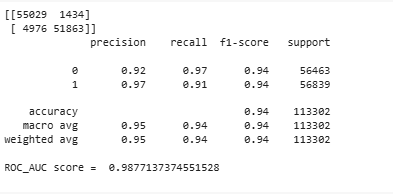
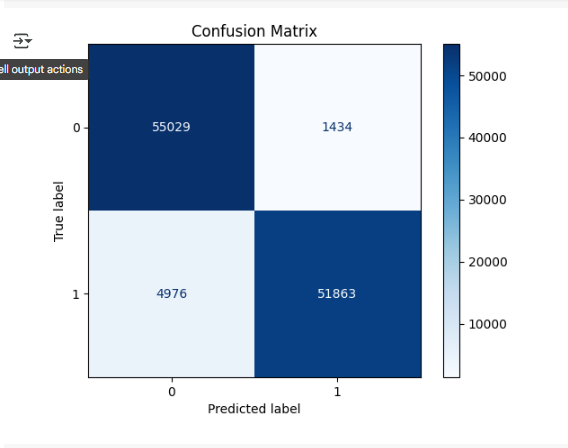

# 💳 Credit Card Fraud Detection App

A binary classification project using **Logistic Regression** to detect fraudulent credit card transactions. Deployed with **Streamlit**, this model achieves an **accuracy of 94%** and includes detailed data analysis, preprocessing, model training, and evaluation.

---

## 📌 Dataset

- **Source:** [Kaggle - Credit Card Fraud Detection](https://www.kaggle.com/datasets/mlg-ulb/creditcardfraud/data)
- Contains anonymized features transformed via **PCA** for confidentiality. Only `'Time'` and `'Amount'` are original.

> **Note:** Due to confidentiality issues, original feature names and descriptions are not available. Features `V1–V28` are the principal components from PCA; `'Time'` and `'Amount'` are untransformed.

---

## 📊 Exploratory Data Analysis (EDA)

- Performed **univariate** and **bivariate analysis** with attractive visuals.
- Analyzed data distributions, trends, and outliers.
- Examined **correlation** and plotted a **heatmap** to detect strongly correlated features.

---

## 🧠 Feature Selection

- Used **Information Value (IV)** for initial feature relevance screening.
- Applied **Variance Inflation Factor (VIF)** to detect and eliminate **multicollinearity**.

---

## ⚙️ Data Preprocessing

- Applied **StandardScaler (Z-score normalization)** to scale features.
- Addressed severe **class imbalance** using **SMOTE** (Synthetic Minority Over-sampling Technique).

---

## 🧪 Model Training

- **Model Used:** Logistic Regression
- Trained on the **preprocessed and balanced** dataset..

---

## ✅ Model Evaluation

### Evaluation Metrics:

- ✅ Confusion Matrix  
- ✅ Classification Report (Precision, Recall, F1-Score, Support)  
- ✅ ROC-AUC Score
- 

### Visualizations:

- 📌 Confusion Matrix Heatmap  
  

- 📌 ROC-AUC Curve  
  

---

## 🚀 Deployment

- Built an interactive UI with **Streamlit**
- Users input **28 PCA components** along with scaled `'Time'` and `'Amount'`
- Model returns **fraud probability** with a clear prediction

---

## 📦 How to Run

```bash
# Install dependencies
pip install -r requirements.txt

# Run the app
streamlit run app.py
